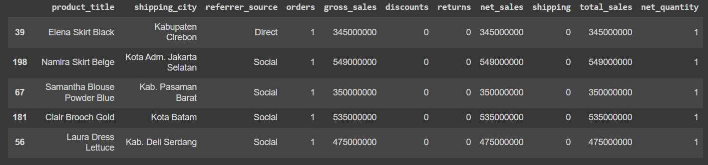
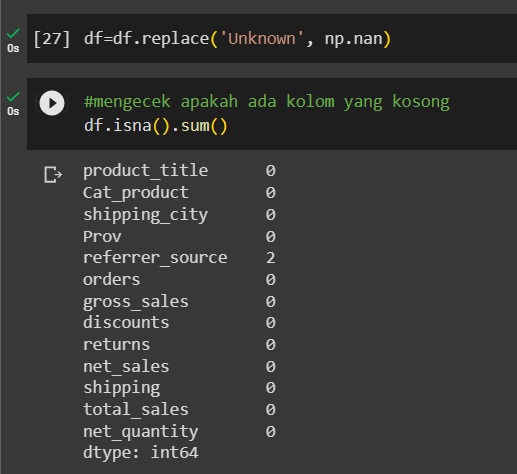
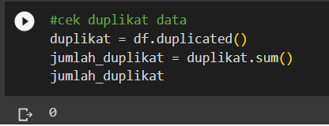
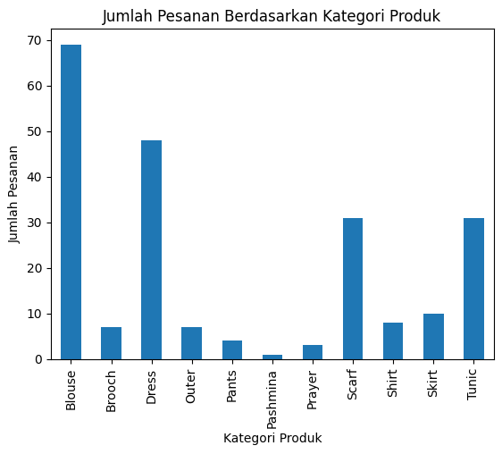
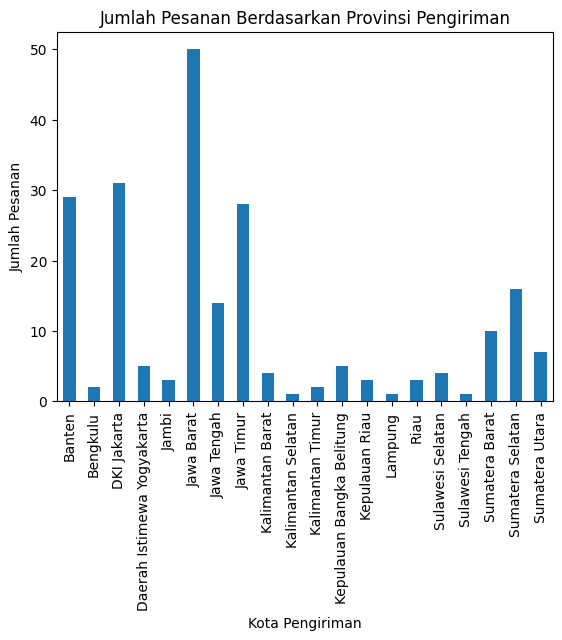
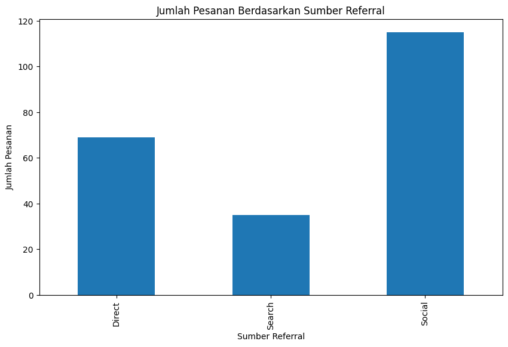
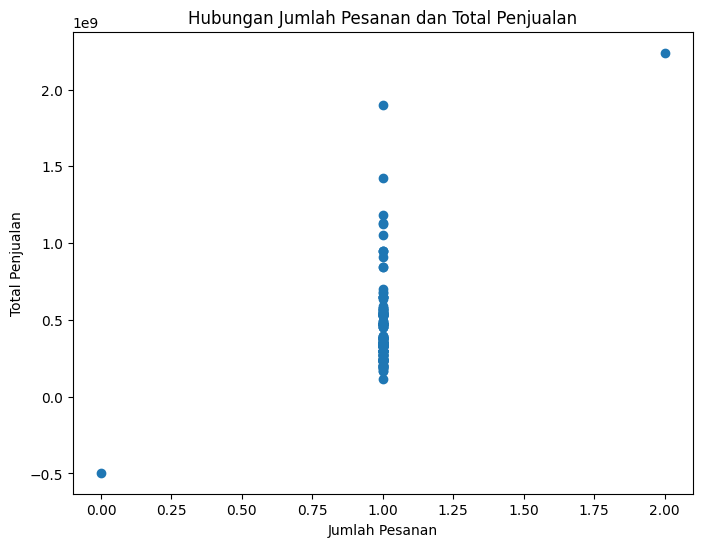

# Clothing Sales Analyst and Visualization
Dalam dunia yang semakin dipenuhi dengan data, penting bagi kita untuk dapat memahami dan menggali wawasan yang berharga dari informasi yang tersedia. Dalam konteks penjualan clothing, analisa dan visualisasi data dapat menjadi alat yang sangat bermanfaat untuk mengungkap tren, pola, dan wawasan bisnis yang dapat menginformasikan keputusan strategis.

## Technologies
- Python
- Pandas 
- jupyter
- numpy
- matplotlib
- seaborn
- google colab

## Pre-Procesing
### 1.Problem Statement
Suatu brand ingin melakukan analisa terhadap penjualannya dan ingin mengetahui trend serta brand awareness terhadap produk mereka. agar dapat mengambil keputusan kedepannya apa yang harus di lakukan.

### 2. Dataset

kolom 'product_title' dan 'shipping_city' memiliki terlalu banyak kategori, oleh karena itu akan di buatkan kategori baru untuk di generealisasikan.
kita tambahkan kolom 'Cat_product' yang merupakan jenis produk dengan mengambil kata ke-2 dari 'product_title',
dan kolom 'prov' yang merupakan provinsi dari nama kota pengiriman 'shipping_city'

.png)

### 3. Missing Value

Terdapat value “Unknown” di kolom referrer_source yang dapat di artikan sebagai 
Missing Value, yang selanjutnya akan di tangani dengan menggunakan modus.

### 4. Duplicate Data

Tidak terdapat data yang duplikat sehingga tidak perlu adanya tindak lanjutan.

## Visualization and Analist

### 1. Frequency Category Product

Kategori dengan jumlah pesanan tertinggi adalah kategori Blouse di ikuti dengan Dress, 
dan kategori dengan pembelian terendah adalah Pashmina. 
Kita dapat memberikan promo khusus untuk pembelian lebih dari 1 atau 2 agar produk 
yang sudah banyak peminatnya ini terjual lebih banyak kuantitasnya. Produk dengan 
pembelian terendah di berikan promo walaupun hanya membeli satu agar dapat 
menarik pembeli dan lebih di promosikan agar masyarakat lebih aware dengan produk 
ini.

### 2. Frequency Category Province

Provinsi dengan pemesanan tertinggi ada di kota Jawa Barat dan provinsi dengan 
pemesanan terendah adalah Sulawesi tengah, Lampung, dan Kalimantan Selatan.
Ibu kota Jakarta berada di posisi kedua dengan jumlah penjualan hamper setengahnya 
dari Jawa Barat, seharusnya Ibu kota Jakarta merupakan penjualan tertinggi di 
karenakan tingkat penduduk dan pusat perbelanjaan lebih banyak di Jakarta.
Kita dappat meningkatkan promosi, iklan, atau kampanye tentang produk kita agar 
dapat meningkatakan brand awareness brand kita ke masyarakat Ibu kota Jakarta.

### 3. Frequency Category Refference

Penjualan terbanyak bersumber dari referensi sosial dan yang terendah adalah 
referensi search. Dapat di simpulkan Produk kita lebih di kenal dari mulut ke mulut. 
Karena kuranganya brand awareness brand kita di masyarakat, kita dapat melakukan 
iklan dan kampanye untuk meningkatkan brand awareness serta kepercayaan ke 
masyarakat tau dan tertarik dengan brand kita.

### 4. Relation of Order and Total Sales

Tidak ada relasi atau tidak dapat di Tarik kesimpulan karena hampir semua penjualan 
hanya menjual 1 barang, dan yang menjual 2 barang hanya sedikit.

### 5. Frequency Based Referral Source for Each Category Product

Dari plot di atas ada hal yang menarik, yaitu produk brooch tidak ada penjualan yang 
berasal dari search, dapat di tarik kesimpulan kurangnya brand awareness di 
masyarakat terhadap produk Brooch.
